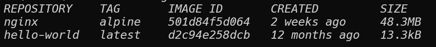

# Imagen
Es un archivo único que contiene todos los programas, librerías, dependencias y configuraciones necesarias para instalar y/o ejecutar una aplicación o un conjunto de aplicaciones.


## ¿Cuál es la relación entre una imagen y un contenedor? 
Una imagen de Docker es como un programa o un archivo ejecutable, mientras que un contenedor es como un proceso en ejecución de ese programa.


## Comandos para imágenes

### Descargar imagen
Descarga la última versión de la imagen disponible en el registro de Docker.

```
docker pull <nombre imagen> 
```

Descarga una versión específica de la imagen, cada imagen tiene etiquetas (tags) para diferentes versiones.
Una imagen puede tener la etiqueta latest para representar la última versión, si no se especifica una etiqueta se hará referencia a la versión latest.

```
docker pull <nombre imagen>:<tag>
```

Descargar la imagen **hello-world**
```
docker pull hello-world
```

**¿Qué es nginx**
NGINX es un servidor web de código abierto cononocido por su versatilidad dentro de este campo. Es conocido por su alta eficiencia, estabilidad y escalabilidad.

Descargar la imagen  **nginx** en la versión **alpine**
```
docker pull nginx:alpine
```

### Listar imágenes

```
docker images
```



**Identificadores**
En Docker, se utilizan varios identificadores para diferenciar de manera única los elementos del sistema, como imágenes, contenedores, volúmenes y redes. Estos identificadores son generados automáticamente por Docker y son únicos dentro del contexto del sistema Docker en el que se encuentran. 

### Inspeccionar una imagen
El comando docker inspect se utiliza para obtener información detallada sobre un objeto de Docker específico, como un contenedor, una imagen, un volumen o una red.  Proporciona información en formato JSON sobre el objeto especificado.

```
docker inspect <nombre imagen>
docker inspect <nombre imagen>:<tag>
```

Inspeccionar la imagen hello-world 
```
docker inspect hello-world
```

**¿Con qué algoritmo se está generando el ID de la imagen**
```
[
    {
        "Id": "sha256:d2c94e258dcb3c5ac2798d32e1249e42ef01cba4841c2234249495f87264ac5a",
        "RepoTags": [
            "hello-world:latest"
        ],
        "RepoDigests": [
            "hello-world@sha256:266b191e926f65542fa8daaec01a192c4d292bff79426f47300a046e1bc576fd"
        ],
        "Parent": "",
        "Comment": "buildkit.dockerfile.v0",
        "Created": "2023-05-02T16:49:27Z",
        "ContainerConfig": {
            "Hostname": "",
            "Domainname": "",
            "User": "",
            "AttachStdin": false,
            "AttachStdout": false,
            "AttachStderr": false,
            "Tty": false,
            "OpenStdin": false,
            "StdinOnce": false,
            "Env": null,
            "Cmd": null,
            "Image": "",
            "Volumes": null,
            "WorkingDir": "",
            "Entrypoint": null,
            "OnBuild": null,
            "Labels": null
        },
        "DockerVersion": "",
        "Author": "",
        "Config": {
            "Hostname": "",
            "Domainname": "",
            "User": "",
            "AttachStdin": false,
            "AttachStdout": false,
            "AttachStderr": false,
            "Tty": false,
            "OpenStdin": false,
            "StdinOnce": false,
            "Env": [
                "PATH=/usr/local/sbin:/usr/local/bin:/usr/sbin:/usr/bin:/sbin:/bin"
            ],
            "Cmd": [
                "/hello"
            ],
            "ArgsEscaped": true,
            "Image": "",
            "Volumes": null,
            "WorkingDir": "/",
            "Entrypoint": null,
            "OnBuild": null,
            "Labels": null
        },
        "Architecture": "amd64",
        "Os": "linux",
        "Size": 13256,
        "GraphDriver": {
            "Data": {
                "MergedDir": "/var/lib/docker/overlay2/930e56d1eb19b1c40d19f6cb7dd0eaaa644442250e37f7ad97c5af5594f7b0a6/merged",
                "UpperDir": "/var/lib/docker/overlay2/930e56d1eb19b1c40d19f6cb7dd0eaaa644442250e37f7ad97c5af5594f7b0a6/diff",
                "WorkDir": "/var/lib/docker/overlay2/930e56d1eb19b1c40d19f6cb7dd0eaaa644442250e37f7ad97c5af5594f7b0a6/work"
            },
            "Name": "overlay2"
        },
        "RootFS": {
            "Type": "layers",
            "Layers": [
                "sha256:ac28800ec8bb38d5c35b49d45a6ac4777544941199075dff8c4eb63e093aa81e"
            ]
        },
        "Metadata": {
            "LastTagTime": "0001-01-01T00:00:00Z"
        },
        "Container": ""
    }
]
```

### Filtrar imágenes

```
docker images | grep <termino a buscar>

```

### Para eliminar una imagen
Eliminar permanentemente la imagen de tu sistema Docker.

```
docker rmi <nombre imagen>:<tag>
```

Eliminar la imagen hello-world
```
docker rmi hello-world
```

-f: Es la opción para forzar la eliminación de la imagen incluso si hay contenedores en ejecución que utilizan esa imagen.
Cuando eliminas una imagen Docker, Docker no elimina automáticamente los contenedores que se han creado a partir de esa imagen. Esto significa que, aunque hayas eliminado la imagen, el contenedor seguirá ejecutándose normalmente.  
**Considerar**
Eliminar una imagen no afecta a los contenedores que se han creado a partir de esa imagen, a menos que esos contenedores dependan de archivos o configuraciones específicas de la imagen eliminada. En ese caso, es posible que los contenedores se comporten de manera inesperada después de eliminar la imagen.
Es una buena práctica detener y eliminar todos los contenedores que dependan de una imagen antes de eliminar la imagen en sí.

```
docker rmi -f <nombre imagen>:<tag>
```

