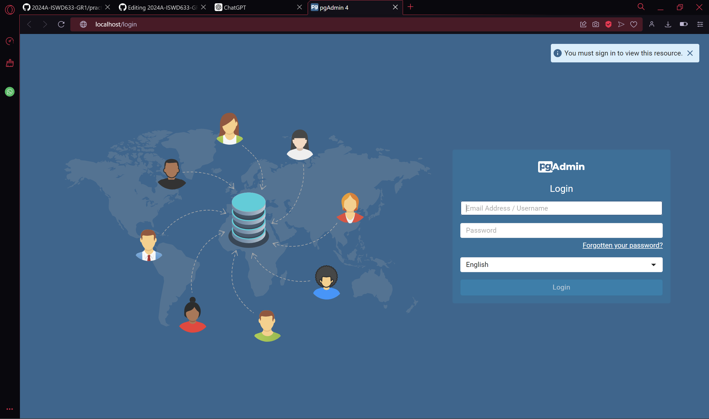
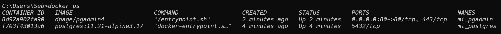
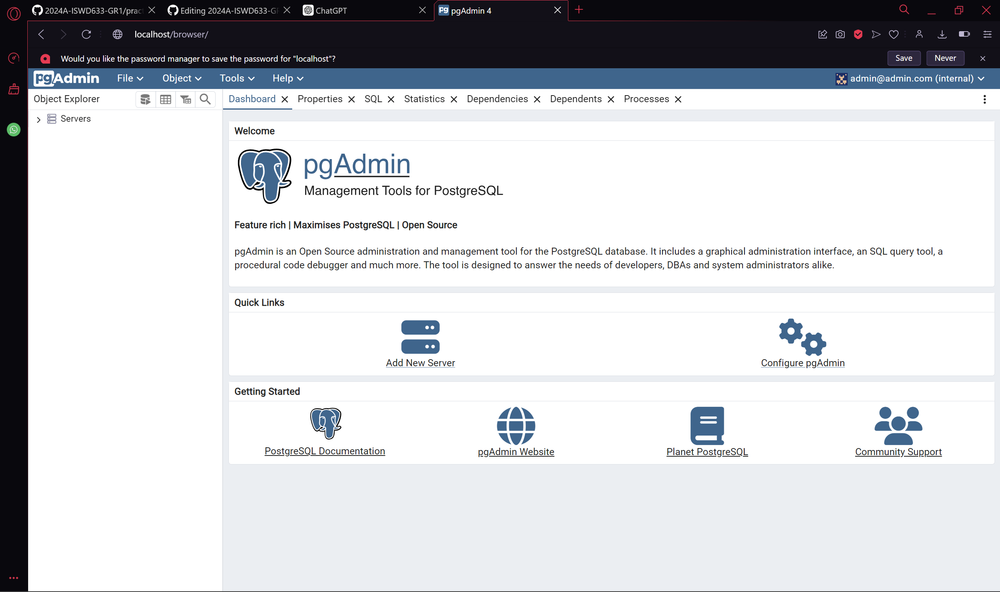
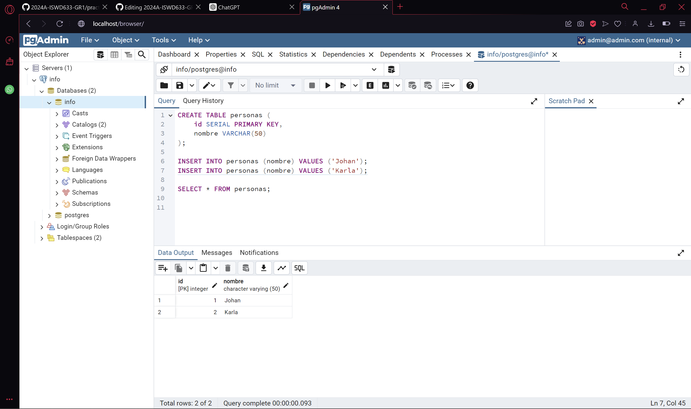
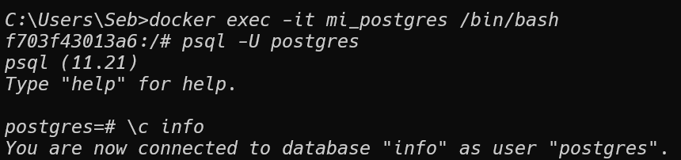

### Crear contenedor de Postgres sin que exponga los puertos. Usar la imagen: postgres:11.21-alpine3.17

```
docker pull postgres:11.21-alpine3.17
docker run -d --name mi_postgres --network mi_red -e POSTGRES_PASSWORD=password123 postgres:11.21-alpine3.17
```

### Crear un cliente de postgres. Usar la imagen: dpage/pgadmin4
```
docker run -d --name mi_pgadmin --network mi_red -e PGADMIN_DEFAULT_EMAIL=admin@admin.com -e PGADMIN_DEFAULT_PASSWORD=admin -p 80:80 dpage/pgadmin4
```

pagina web de http://localhost


La figura presenta el esquema creado en donde los puertos son:

- a: 80
- b: 443
- c: 5432


## Desde el cliente
### Acceder desde el cliente al servidor postgres creado.



### Crear la base de datos info, y dentro de esa base la tabla personas, con id (serial) y nombre (varchar), agregar un par de registros en la tabla, obligatorio incluir su nombre.



## Desde el servidor postgresl
### Acceder al servidor
### Conectarse a la base de datos info

Acceder al contenedor
```
docker exec -it mi_postgres /bin/bash
```

Conectarse al PostgreSQL
```
psql -U postgres
```

Acceder a la base de datos
```
\c info
```



### Realizar un select *from personas


