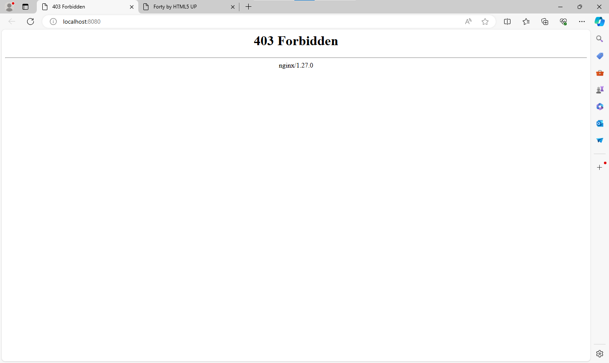

# VOLUMEN TIPO HOST
Un volumen host (o bind mount) es un tipo de volumen donde se monta un directorio o archivo específico del sistema de archivos del host en un contenedor.

```
docker run -d --name <nombre contenedor> -v <ruta carpeta host>:<ruta carpeta contenedor> <imagen> 
```

### Crear un volumen tipo host con la imagen nginx:alpine, para la ruta carpeta host: directorio en donde se encuentra la carpeta html en tu computador y para la ruta carpeta contenedor: /usr/share/nginx/html esta ruta se obtiene al revisar la se obtiene desde la documentación


```
docker run -d --name mi_nginx -p 8080:80 -v .:/usr/share/nginx/html nginx:alpine
```

### ¿Qué sucede al ingresar al servidor de nginx?

En el servidor nginx me da el error 403 Forbidden



### ¿Qué pasa con el archivo index.html del contenedor?

No existe ningun archibo index.html en el contenedor, la carpeta html esta vacia


### Ir a https://html5up.net/ y descargar un template gratuito, descomprirlo dentro de nginx/html
### ¿Qué sucede al ingresar al servidor de nginx?

Ahora el template que hemos descomprimido en la ruta de la carpeta host se muestra el templade accediendo a la pagina en la cual antes nos daba error


### Eliminar el contenedor

```
docker rm -f mi_nginx
```

### ¿Qué sucede al crear nuevamente el mismo contenedor con volumen de tipo host a los directorios definidos anteriormente?

Al estarle dando un direccionamiento a nuestro volumen host, el contenedor nginx usa este volumen el cual no se ha eliminado al borrar el contenedor, por lo tanto todavia muestra el template que esta en el volumen del host

### ¿Qué hace el comando pwd?

"pwd" o "print working directory" muestra el directorio actual en el que te encuentras dentro de la estructura de archivos del contenedor.

Si quieres incluir el comando pwd dentro de un comando de Docker, lo puedes hacer de diferentes maneras dependiendo del shell que estés utilizando.


### Volumen tipo host usando PWD y PowerShell
```
docker run -d --name <nombre contenedor> --publish published=<valorPuertoHost>,target=<valor> -v ${PWD}/<ruta relativa>:<ruta absoluta> <nombre imagen>:<tag> 
```

### Volumen tipo host usando PWD (Git Bash)

```
docker run -d --name <nombre contenedor> --publish published=<valorPuertoHost>,target=<valor> -v $(pwd -W)/html:/usr/share/nginx/html <nombre imagen>:<tag> 
```

### Volumen tipo host usando PWD (en Linux)

```
docker run -d --name <nombre contenedor> --publish published=<valorPuertoHost>,target=<valor> -v $(pwd)/html:/usr/share/nginx/html <nombre imagen>:<tag> 
```

